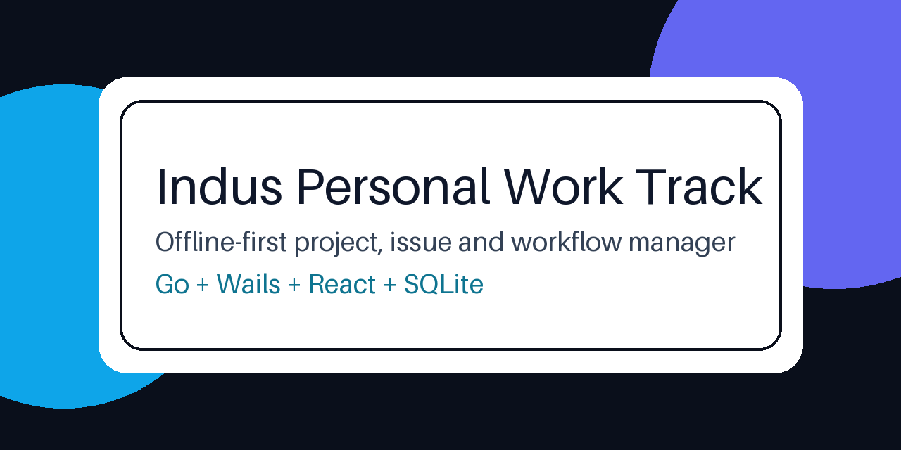

# Indus Personal Work Track



Offline-first desktop app to manage projects, issues, workflows, comments, and team roles (`admin`, `developer`, `reporter`) using a local SQLite database.

## Why this app
- No cloud dependency for core usage.
- Simple role-based access control (RBAC).
- Workflow-based issue movement.
- Lightweight desktop delivery through Wails (Go + React).

## Quick Start (Non-Technical)
1. Download the Windows build from `backend/build/bin/IndusTaskManager.exe` or release zip.
2. Run `first-run-check.cmd` (included in release package).
3. Open `IndusTaskManager.exe`.
4. Login using default users:
   - `admin`
   - `developer`
   - `reporter`

## Data Location
- Database file: `%APPDATA%\indus-task\indus-task.db`

## Production Build
### Build app + NSIS installer
```powershell
cd backend
$env:Path += ";$env:USERPROFILE\go\bin"
wails build -clean -nsis
```

### Package release bundle (exe + installer + first-run scripts)
```powershell
powershell -ExecutionPolicy Bypass -File scripts\package-release.ps1
```

## First-Run Validation Script
- PowerShell: `scripts/first-run-check.ps1`
- Double-click helper: `scripts/first-run-check.cmd`

Checks:
- WebView2 runtime availability
- app data folder creation and write access
- executable presence
- optional app launch

## Architecture Diagrams (Transparent SVG)

### 1) System Architecture


### 2) Backend Layered UML


### 3) RBAC Sequence UML


### 4) Issue Workflow State UML


### 5) Core Data Model ERD


## Tech Stack
- Backend: Go, Wails, SQLx, SQLite
- Frontend: React + TypeScript + Vite
- Packaging: Wails build + NSIS installer

## Project Structure
```text
backend/               Go app, services, repositories, Wails entrypoint
backend/frontend/      React UI used by Wails
docs/diagrams/         Transparent SVG architecture/UML diagrams
docs/assets/           README visual assets
scripts/               Build, release, and first-run helper scripts
```

## License
MIT - see [LICENSE](LICENSE)
